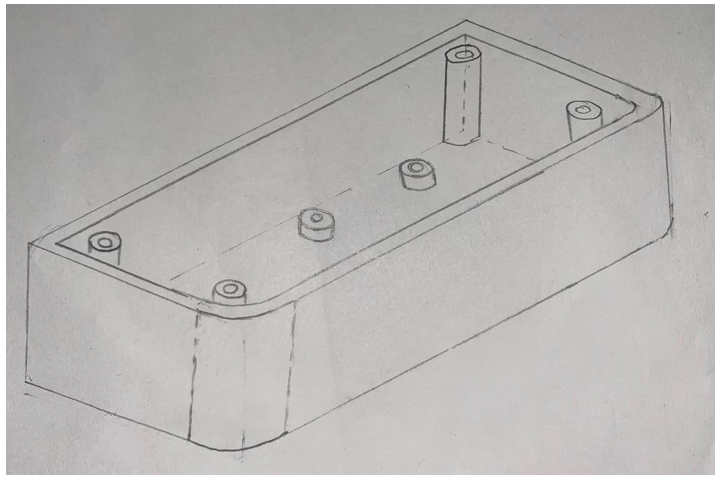
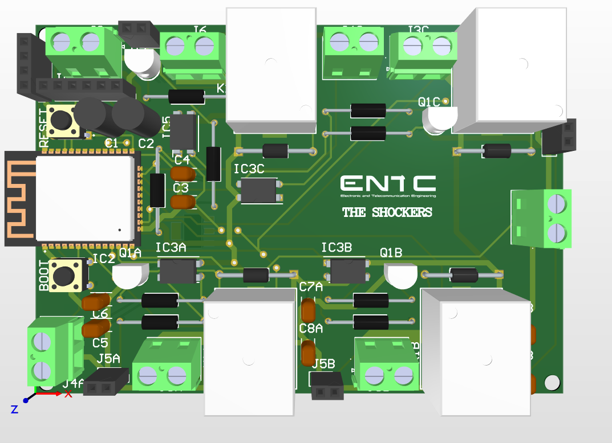

# The Smart Extension Cord 💡🔌

**Project Report**
Department of Electronic & Telecommunication Engineering,
University of Moratuwa, Sri Lanka.
EN1190 Engineering Design Project - August 2024

## 🚀 Project Overview

Many households struggle with a lack of visibility into the power consumption of individual devices, making it difficult to optimize energy usage. Traditional power strips lack remote control, leading to inconvenience and energy wastage. This project, "The Smart Extension Cord," aims to address these limitations by providing a comprehensive solution for efficient energy management. ✨

Our smart extension cord system integrates power consumption monitoring and the ability to control multiple outlets remotely via a smartphone app 📱. This provides a holistic approach to managing energy usage efficiently and conveniently, promoting energy savings 💰 and offering a user-friendly experience.

## 🌟 Key Features

*   ✅ **Remote On/Off Functionality:** Control individual outlets remotely.
*   📊 **Power Consumption Monitoring:** Track energy usage of connected devices.
*   🔗 **Multiple Outlets:** Manage several devices simultaneously.
*   🤳 **Smartphone App Control:** Intuitive mobile application for monitoring and control.

## 🤔 Justification for Selection

A survey (70 responses) revealed that 81.4% of individuals had not encountered a product monitoring power consumption of various devices. Key reasons for interest in a smart extension cord include:
*   Energy Savings (80%) 🌿
*   Convenience (65.7%) 👍
*   Security (27.1%) 🛡️

  

  Figure 1: Analysis of user interest drivers.

**

## 🏗️ System Architecture

The system architecture is designed for robust performance and ease of use.

  

  Figure 2: System Block Diagram.

## 🛠️ Technology Stack

### Key Hardware Components 🔩
*   ESP32-WROOM-32 Microcontroller
*   ACS712 ICs (Current Sensors)
*   ZMPT101B Voltage Sensor
*   5V Power Supply
*   5V Relays

### Software & Tools 💻
*   **PCB Design & Simulation:** Proteus, Altium Designer, LTspice
*   **Smartphone Application:** MIT App Inventor, Firebase
*   **Enclosure Design:** SolidWorks

## 🎨 Product Design & Enclosure

### Initial Sketches ✍️
The enclosure was designed for functionality, safety, and aesthetics.

  

  Figure 3: Initial Sketch of the Top Enclosure Part.

  

  Figure 4: Initial Sketch of the middle Enclosure Part.

  

  Figure 5: Initial Sketch of the Lower Enclosure Part.

### Final CAD Design (SolidWorks) 🧊
Finalized designs were created for 3D printing.

  

  Figure 6: Final CAD Model of the Upper Enclosure Part.

  

  Figure 7: Final CAD Model of the Middle Enclosure Part.

  

  Figure 8: Final CAD Model of the Lower Enclosure Part.

## 🔬 PCB Design

### Schematics 📝
Detailed schematics were designed for the system's electronics.

  

  Figure 9: Schematic Sheet 1 - Microcontroller and Power Management.

  

  Figure 10: Schematic Sheet 2 - Relay and Current Sensor for an Outlet.

  

  Figure 11: Schematic Sheet 3 - Master Relay for Overall Power Control.

### PCB Layout 🖼️
The PCB was designed using Altium Designer.

**2D Layout Mode**

  

  Figure 12: 2D PCB Layout.

**2D Layout Mode with Multi-Layer View**

  

  Figure 13: 2D PCB Layout with Multi-Layer View.

**3D Layout Mode**

  

  Figure 14: 3D Rendered PCB Layout.

## ✨ Final Product 🎉

The assembled Smart Extension Cord, focusing on durability, safety, and aesthetics using fire-resistant materials.

  

  Figure 15: Top View of the Assembled Smart Extension Cord.

  

  Figure 16: Side View of the Assembled Smart Extension Cord.

---

This README provides a comprehensive overview of "The Smart Extension Cord" project, its design, and implementation.
